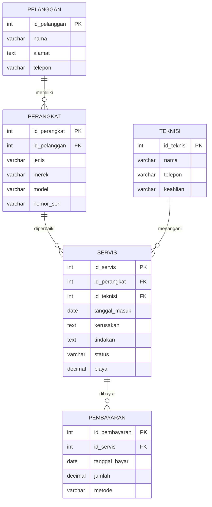

# ERD Manajemen Servis Komputer

```mermaid
erDiagram
    PELANGGAN ||--o{ PERANGKAT : memiliki
    PERANGKAT ||--o{ SERVIS : diperbaiki
    TEKNISI ||--o{ SERVIS : menangani
    SERVIS ||--o{ PEMBAYARAN : dibayar

    PELANGGAN {
      int id_pelanggan PK
      varchar nama
      text alamat
      varchar telepon
    }
    PERANGKAT {
      int id_perangkat PK
      int id_pelanggan FK
      varchar jenis
      varchar merek
      varchar model
      varchar nomor_seri
    }
    TEKNISI {
      int id_teknisi PK
      varchar nama
      varchar telepon
      varchar keahlian
    }
    SERVIS {
      int id_servis PK
      int id_perangkat FK
      int id_teknisi FK
      date tanggal_masuk
      text kerusakan
      text tindakan
      varchar status
      decimal biaya
    }
    PEMBAYARAN {
      int id_pembayaran PK
      int id_servis FK
      date tanggal_bayar
      decimal jumlah
      varchar metode
    }
```
